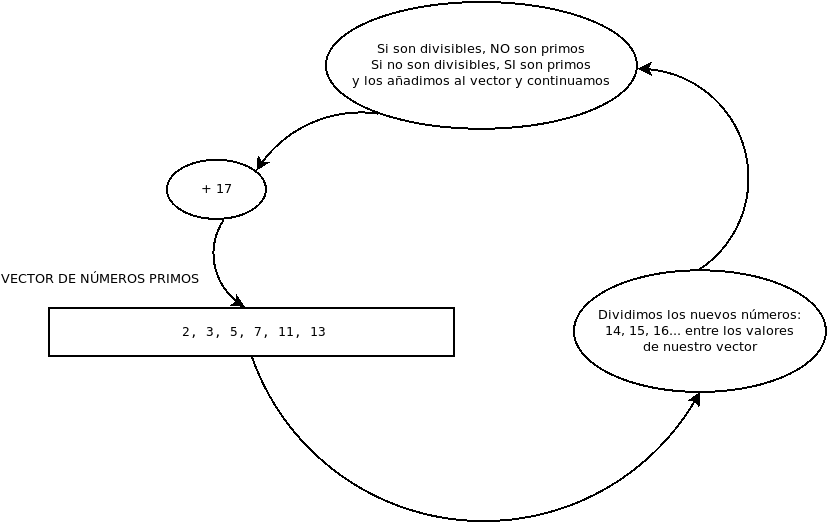

Cálculo de números primos con MPICH // Prime numbers calculation using MPICH
===

## Purpose and Algorithm



La idea es implementar este algoritmo de cálculo de números primos en programación distribuida empleando la librería MPICH.

Partimos de almacenar los números primos obtenidos de un vector de números, el nodo maestro repartirá estos números (gather) entre los distintos nodos del clúster.

Irá preguntando por los siguientes números que se calculen a cada nodo (con un reduce), de forma que si un número nuevo resulta primo se añade al vector, y se vuelve a repartir y a seguir con los cálculos.

## Files

### main_one.c

Es el algoritmo, empleando MPICH pero sin dividir el trabajo, un solo proceso almacena el vector de números primos y ejecuta el cálculo.

Los pasos para compilarlo y ejecutarlo serían:

```
mpicc -o ./primes_one ./main_one.c
mpirun -np 1 ./primes_one
```

### main_v1.c

Es el algoritmo, empleando MPICH dividiendo el vector de números primos calculados y el trabajo para comprobar si un nuevo número es o no primo dividiéndolo por ese vector.

Los pasos para compilarlo y ejecutarlo serían:

```
mpicc -o ./primes_v1 ./main_v1.c
mpirun -f ./machinefile ./primes_v1
```

### main_v2.c

Es el algoritmo, empleando MPICH dividiendo el vector de números primos calculados y el trabajo para comprobar si un nuevo número es o no primo dividiéndolo por ese vector.

Lo optimizamos un poco, no hay que volver a calcular el vector local de números primos para nodo en cada iteración si no hemos encontrado un nuevo número primo y hemos actualizado el vector global de números primos, ¿no?

Los pasos para compilarlo y ejecutarlo serían:

```
mpicc -o ./primes_v2 ./main_v2.c
mpirun -f ./machinefile ./primes_v2
```

### main_v3.c

Lo optimizamos un poco más aún, el reparto de un nuevo número primo lo conoce todos los nodos al empezar este reparto en 0 y recorrerse en el tamaño del clúster.

Todos los nodos saben si un nuevo número es primo o no, porque el cálculo lo hacemos con un allreduce, de forma que si hay un nuevo número primo, el nodo 0 se encarga de actualizarle a otro nodo su vector de números primos.

Los pasos para compilarlo y ejecutarlo serían:

```
mpicc -o ./primes_v3 ./main_v3.c
mpirun -f ./machinefile ./primes_v3
```

## Copyright

2024 Joaquín Cuéllar \<joaquin.cuellar(at)uco(dot)es\>

## License

```
Prime numbers calculation using MPICH is free software: you can redistribute it and/or modify
it under the terms of the GNU General Public License as published by
the Free Software Foundation, either version 3 of the License, or
(at your option) any later version.

Prime numbers calculation using MPICH is distributed in the hope that it will be useful,
but WITHOUT ANY WARRANTY; without even the implied warranty of
MERCHANTABILITY or FITNESS FOR A PARTICULAR PURPOSE.  See the
GNU General Public License for more details.

You should have received a copy of the GNU General Public License
along with this program.  If not, see <https://www.gnu.org/licenses/>.
```

## images license

./algorithm.png

is licensed under CC-BY-SA
copyright 2024 Joaquín Cuéllar \<joaquin.cuellar(at)uco(dot)es\>